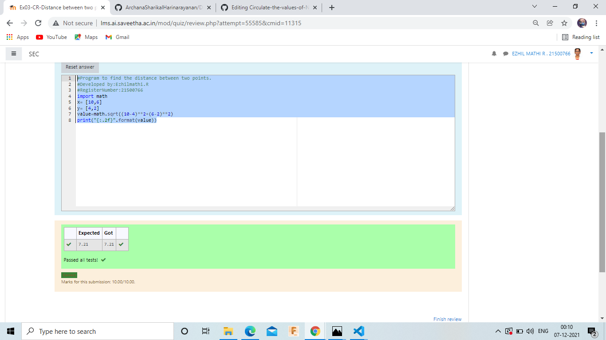

# DISTANCE-BETWEEN-TWO-POINTS

## AIM:
To write a python program to find the distance two 2 points
## ALGORITHM:
### Step 1: 
  Import numpy module as np to use the built - in function for calculating 
  the distance between the two points
### Step 2: 
  Get the x1 and x2 values from the user to calculate the distance between the
  two points
### Step 3: 
  Substitute the values in the distance formula 
### Step 4: 
  Print the distance between the two points in two decimal 
### Step 5:  
  End the program
### PROGRAM:
```
#Program to find the distance between two points.
#Developed by:Ezhilmathi.R
#RegisterNumber:21500766
import math
x= [10,6]
y= [4,2]
value=math.sqrt((10-4)**2+(6-2)**2)
print("{:.2f}".format(value))
```

### OUTPUT:



### RESULT:
Thus a python program to find  the distance between the two points is  excecuted successfully.